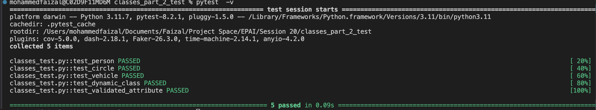

# Classes and Properties in Python

This Python module demonstrates the use of classes, properties, and validation techniques in object-oriented programming.

## Concepts Covered

1. **Classes and Objects**: Defining Python classes with methods and attributes.
2. **Properties**: Using `@property` decorators to define getters and setters for class attributes.
3. **Validation**: Ensuring that values are validated using custom setters and raising errors when necessary.
4. **Static and Class Methods**: Demonstrating the use of `@staticmethod` and `@classmethod` for operations that are not bound to instance-specific data.
5. **Inheritance**: Using inheritance to extend base classes and modify behavior.
6. **Dynamic Attributes**: Dynamically adding and accessing attributes at runtime.


## Class Overview

### 1. **Person Class**
This class represents a person, with properties for the full name, birth year, and age. It validates the birth year to ensure it falls within a realistic range.

#### Concepts:
- **Properties**: `full_name`, `age`, `birth_year`
- **Setter Validation**: Ensures valid birth year
- **Dynamic Calculation**: Age is dynamically calculated based on the current year

#### Code:
```python
from datetime import datetime

class Person:
    def __init__(self, first_name, last_name, birth_year):
        self.first_name = first_name
        self.last_name = last_name
        self.birth_year = birth_year

    @property
    def birth_year(self):
        return self._birth_year

    @birth_year.setter
    def birth_year(self, year):
        current_year = datetime.now().year
        if not isinstance(year, int) or year <= 1900 or year > current_year:
            raise ValueError("Invalid birth year.")
        self._birth_year = year

    @property
    def age(self):
        return datetime.now().year - self._birth_year
```

---

### 2. **Circle Class**
The `Circle` class models a circle, with properties for radius, diameter, and area. The area is cached to optimize repeated access, and validation ensures the radius is positive.

#### Concepts:
- **Property Caching**: Caches the area for performance
- **Setter Validation**: Ensures radius is positive
- **Mathematical Computation**: Diameter and area calculations

#### Code:
```python
import math

class Circle:
    def __init__(self, radius):
        self._radius = radius
        self._cached_area = None

    @property
    def radius(self):
        return self._radius

    @radius.setter
    def radius(self, value):
        if value < 0:
            raise ValueError("Radius must be positive.")
        self._radius = value
        self._cached_area = None

    @property
    def area(self):
        if self._cached_area is None:
            self._cached_area = math.pi * (self.radius ** 2)
        return self._cached_area
```

---

### 3. **Vehicle Class**
The `Vehicle` class models a basic vehicle with a static method for classification and a class variable to track the number of vehicles created.

#### Concepts:
- **Class Variables**: Tracks vehicle count
- **Static Method**: Classifies a vehicle type without needing an instance

#### Code:
```python
class Vehicle:
    vehicle_count = 0

    def __init__(self, make, model, year):
        self.make = make
        self.model = model
        self.year = year
        Vehicle.vehicle_count += 1

    @staticmethod
    def classify_vehicle(vehicle_type):
        return f"This is a {vehicle_type}"
```

---

### 4. **ElectricVehicle Class**
The `ElectricVehicle` class extends `Vehicle` and overrides the classification method to specifically handle electric vehicles.

#### Concepts:
- **Inheritance**: Inherits from `Vehicle` and overrides a method

#### Code:
```python
class ElectricVehicle(Vehicle):
    @staticmethod
    def classify_vehicle(vehicle_type):
        return f"This is an electric {vehicle_type}"
```

---

### 5. **DynamicClass Class**
This class demonstrates dynamic attribute handling. It allows adding and accessing attributes at runtime via a dictionary and a custom `__getattr__` method.

#### Concepts:
- **Dynamic Attributes**: Adds attributes dynamically
- **Custom `__getattr__`**: Handles dynamic attribute access

#### Code:
```python
class DynamicClass:
    def __init__(self):
        self.attributes = {}

    def dynamic_attr(self, name, value):
        self.attributes[name] = value

    def __getattr__(self, name):
        if name in self.attributes:
            return self.attributes[name]
        raise AttributeError(f"'{self.__class__.__name__}' object has no attribute '{name}'")
```

---

### 6. **ValidatedAttribute Class**
The `ValidatedAttribute` class ensures that a value is always a positive integer by raising an exception if the value does not meet the criteria.

#### Concepts:
- **Validated Properties**: Ensures only valid values are assigned to attributes

#### Code:
```python
class ValidatedAttribute:
    def __init__(self):
        self._value = 0

    @property
    def value(self):
        return self._value

    @value.setter
    def value(self, new_value):
        if new_value < 0:
            raise ValueError("Value must be positive.")
        self._value = new_value
```

---

## Tests

The tests cover the following aspects:

- **Property Handling and Validation**: Ensures that the `Person` class correctly handles age and birth year, with proper validation.
- **Dynamic Attribute Management**: Verifies that the `DynamicClass` correctly manages attributes dynamically.
- **Mathematical Computations**: Confirms that the `Circle` class calculates diameter and area accurately.
- **Static and Class Methods**: Ensures that the `Vehicle` and `ElectricVehicle` classes handle class variables and static methods correctly.
- **Error Handling**: Validates that appropriate errors are raised when invalid inputs are provided (e.g., negative radius or invalid birth year).

### Tests Summary:
- **Person**: Tests for correct age calculation, name changes, and salary updates. Validates birth year with proper error handling.
- **Circle**: Validates radius, diameter, and area calculations. Ensures that negative radius values raise errors.
- **Vehicle**: Confirms vehicle count and classification. Tests inheritance and overriding methods in `ElectricVehicle`.
- **DynamicClass**: Tests dynamic attribute assignment and retrieval using `__getattr__`.
- **ValidatedAttribute**: Ensures that only positive values are accepted, raising an error for negative values.

### Test Results

